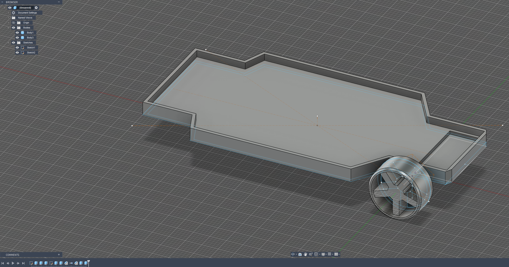
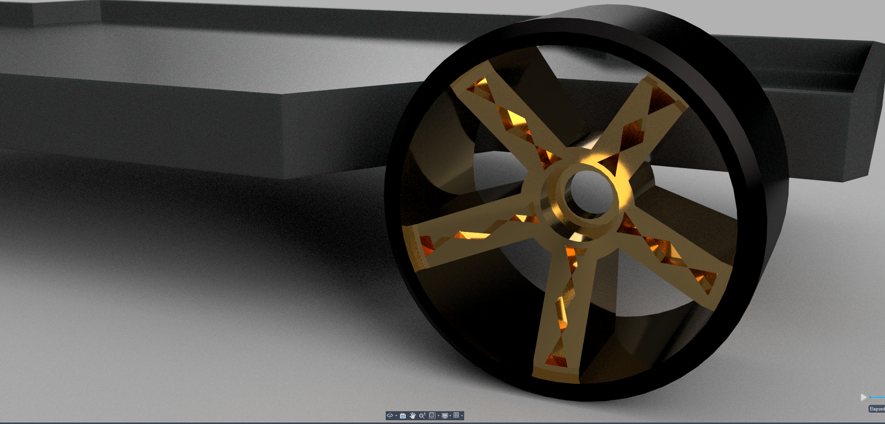

# Journal

## 2025-12-02 - Ideated/Picked Components/Began CAD - 1.5 hours 
*I was still planning to make a regular RC drift car*    
Ideated, picked out initial components (i.e. servo), got dimensions from Amazon, and began design on CAD. Set up chassis and began first wheel (based on the ROTA RT-5F). Decided specifically on a drift car (smooth wheels), since I'd like to drift it around my house. Included low ground clearance like a race chassis would have. Screenshot of some progress from CAD is attached.  

  
## 2025-12-03 - Updated CAD Design + Redid my overall plan - 3.0 hours
*I had changed my plan, but was planning to make a RC drift car that streamed to and was controlled from my iPhone*  
Worked on making the design look cool, updating the wheel significantly. I also redid my plan to include an FPV camera and raspberry pi pico, worked out basic logistics for control/streaming from/to a phone, and began work on the iPhone app.  

## 2025-12-04 - Picked Final Components, Completed BOM, Changed Plan - 2.0 hours
I realized that control/streaming to/from a phone might be a bit too costly and not very feasible, since I'd need an additional receiver and some way to get data to/from my phone. I also learned that a RasPi Pico cannot reliably stream video unlike a larger model.  
  
I thus updated my plan to a more traditional FPV RC Drift Car, which worked out well since a friend of mine is willing to let me work with one of his FPV controllers and a camera/transmitter.  
  
I put together an updated BOM, which you can check out here, and in the github repo: https://docs.google.com/spreadsheets/d/1Lv73VUDTXfWE0b1IzYuDMYUU8_JK1C5DVHMVwzFLLAM/edit?gid=0#gid=0  
  
I continued the CAD process, and incorporated my newly picked components. A screenshot from Fusion with the electronics sketched out on it is attached.  

