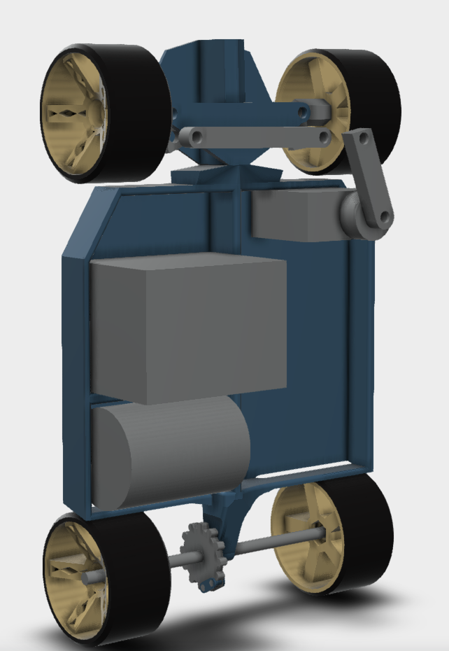

# FPV RC Drift Car
This project is my first ever RC build, an indoor drift car with an FPV camera. I chose to build it since I wanted to learn about the inner workings of RC vehicles, and because I'm a huge car enthusiast. Through this project, I learned about motors, controllers, servos, CAD design, and more. :)

This car will be RWD, with smooth wheels (no traction) for drifting, and a single motor mounted to the rear axle. The front axle will be steered by two servos. It will also be powered by a 3S LiPo battery, which will be mounted to the rear of the car.

This car will not need any custom firmware, since the components come with it built-in, and I will be using ExpressLRS, which is a free and open-source firmware for RC receivers.

# Components  
Refer to the parts list at [BOM.csv](https://github.com/a-finance-bro/fpv-drift-car/blob/main/BOM.csv).  
  
For the latest, updated version of the BOM, see here: https://docs.google.com/spreadsheets/d/1Lv73VUDTXfWE0b1IzYuDMYUU8_JK1C5DVHMVwzFLLAM/edit?gid=0#gid=0
  
This project's total funding request is $40.16. The total cost to build this project without borrowing an RC controller, FPV receiver, and battery is likely much higher, potentially upwards of $300 (an estimate for the parts I'm using is provided in the BOM).  

# BOM (table format)

| Name | Description | Unit Price | Amount | Total Price | Running Total | Need to Purchase? | Funding Total | Link (cheapest) |
|---|---|---|---|---|---|---|---|---|
| Motor/Controller Kit | Controller for speed modulation + the main motor.. | $23.19 | 1 | $23.19 | $23.19 | Y | $23.19 | [Link](https://www.aliexpress.com/item/32485224104.html) |
| FPV Camera/Transmitter | Integrated camera/transmitter to transmit live video. | $22.99 | 1 | $22.99 | $46.18 | N (borrowed from friend) | $23.19 | Amazon.com: AKK C1T Super Mini 5.8GHz 25mW FPV Transmitter 600TVL Micro AIO Camera Only 2.8g with Dipole Antenna for FPV Drone |
| RC Receiver | Receiver to receive steering/speed changes. | $14.99 | 1 | $14.99 | $61.17 | Y | $38.18 | [Link](https://radiomasterrc.com/products/er4-2-4ghz-elrs-pwm-receiver) |
| Controller | Controller with which to drive the car. | $204.98 | 1 | $204.98 | $266.15 | N (borrowed from friend) | $38.18 | [Link](https://www.amazon.com/Radiomaster-Digital-XROSSBAND-EXpressLRS-Controller/dp/B0DSFDZ3NF/ref=sr_1_2_sspa?crid=1HOMKNYX0C6P&dib=eyJ2IjoiMSJ9.CT9pHPSrin_g6CmLvCQslFk7izY4VWLgly_uE1wif1hxQYM_d3Il4rGGxesx7QjAk-Fz7UprKvdSmZQjghw0L7Iteu2GCZPw3CBW5JhfYmksXUq_KGmiQ5YT3kDle6T1I0jEn-B1N8EUZ94I3SbsfyiCm3oYjzsFR7-DJDi8QQ9uU0BLr4fMrxVZnIBfTI6Z-n4hrN4ncQGpeXm7kQATbwFa5sojvJLLVo5FHyWI6e7wrbMRjdO6V8uFc3at4yrxU7XSeWEYKAjjS6vc0FzivdjJI4Fb8PjbfHVqBZap8.6cM-vykcRVWLctYW-UPscuJ0qQ47jHW7lXqLjgt0U-c&dib_tag=se&keywords=radiomaster+gx12&qid=1764917570&sprefix=radiomaster+gx12%2Caps%2C170&sr=8-2-spons&sp_csd=d2lkZ2V0TmFtZT1zcF9hdGY&psc=1) |
| Servos | Servos for steering. | $0.99 | 2 | $1.98 | $268.13 | Y | $40.16 | [Link](https://www.aliexpress.us/item/3256806338932286.html?spm=a2g0o.detail.imageSearch.1.55acjKjtjKjtmF&utparam-url=scene%3AimageSearch%7Cquery_from%3Adetail_bigimg%7Cx_object_id%3A1005006525247038%7C_p_origin_prod%3A&algo_pvid=f27666d0-6fec-466c-b6ae-230fcdd6a77b&algo_exp_id=f27666d0-6fec-466c-b6ae-230fcdd6a77b&pdp_ext_f=%7B%22order%22%3A%2242%22%2C%22fromPage%22%3A%22search%22%7D&pdp_npi=6%40dis%21USD%213.54%210.99%21%21%213.54%210.99%21%402101f54117649963625152418efc0a%2112000037527772309%21sea%21US%210%21ABX%211%210%21n_tag%3A-29910%3Bd%3A2df7b1f6%3Bm03_new_user%3A-29895%3BpisId%3A5000000187480164&gatewayAdapt=4itemAdapt) |
| Batteries | Batteries to power the car. | $10.62 | 1 | $10.62 | $278.75 | N (borrowed from friend) | $40.16 | [Link](https://www.aliexpress.com/item/1005009576136956.html) |

# Images!

